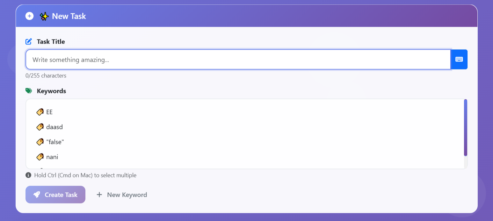
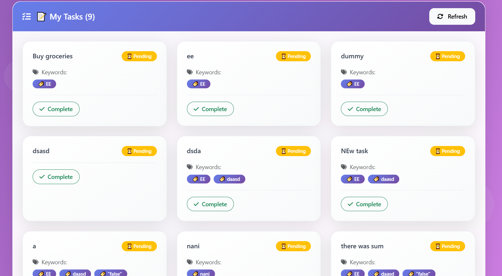

# 🗂️ Tasks App — Proyecto Completo (Backend + Frontend)

Este repositorio contiene la solución completa para una app interna de gestión de tareas, dividida en dos carpetas principales:

- `api/` → Backend en **Laravel** con arquitectura limpia (Clean Architecture) y API REST para gestión de tareas y palabras clave.
  > Consulta el README.md dentro de `api/` para detalles específicos de instalación, configuración y ejecución del backend.

- `frontend/` → Frontend en **Vue 3** con Composition API y Bootstrap consumiendo la API.
  > Consulta el README.md dentro de `frontend/` para instrucciones detalladas para arrancar el frontend y configuraciones específicas.

---

  


---

## 📖 Resumen del proyecto

Este proyecto implementa una app completa para gestión de tareas con las siguientes características clave:

- **Arquitectura limpia (Clean Architecture)** que separa dominio, casos de uso, infraestructura y presentación para facilitar mantenimiento y escalabilidad.
- Backend en **Laravel** y frontend en **Vue 3** con Composition API y diseño moderno responsivo.
- Gestión avanzada de tareas con estado, palabras clave, validaciones en tiempo real y UI amigable.
- Flujo de trabajo basado en **GitFlow** para organizar ramas feature, develop y main.
- **Pipelines CI/CD configurados para máxima calidad y automatización:**

  - En cada **Pull Request (PR)** se ejecutan:
    - **Tests automáticos** para backend y frontend.
    - **Builds** para validar que el código compila y funciona.
    - **Spell check** para detectar errores ortográficos en documentación y código.
    - **Reglas Lint** para mantener estilo y calidad de código consistente.

  - En cada **push a la rama main** se ejecutan:
    - Tests completos con reporte de **coverage** para asegurar alta cobertura.
    - **Builds de artefactos** listos para producción.
    - Publicación automática de releases, que puede incluir:
      - Distribución mediante **Firebase App Distribution**.
      - Deploy con **Codemagic** (para apps móviles).
      - Compilados y artefactos publicados directamente en GitHub Releases.

Este enfoque garantiza que cada cambio pase por estrictos controles de calidad y que las releases se publiquen de forma automatizada y segura, facilitando la entrega continua.

---

## 📂 Estructura del repositorio y Clean Architecture

```plaintext
/
├── api/                 # Backend Laravel
│   ├── Application/     # Casos de uso (UseCases)
│   ├── Domain/          # Entidades y contratos
│   ├── Http/            # Controladores, Requests, Responses
│   ├── Infrastructure/  # Repositorios Eloquent y adaptadores
│   ├── Models/          # Modelos Eloquent
│   └── Providers/       # Providers Laravel
│
├── frontend/            # Frontend Vue 3 + Bootstrap
│   ├── src/
│   │   ├── components/       # Componentes UI (TaskList.vue, etc.)
│   │   ├── composables/      # Lógica reusable (API, validaciones)
│   │   ├── domain/
│   │   │   └── entities/     # Modelos de dominio (Task, Keyword)
│   │   ├── infrastructure/
│   │   │   ├── http/         # Configuración axios
│   │   │   └── services/     # Servicios API
│   │   └── utils/            # Utilidades y validadores
│   └── public/
│
├── screenshots/          # Capturas de pantalla para README
├── README.md             # Archivo principal de documentación
└── ...
````

---

## ⚙️ Cómo arrancar el proyecto

### 1. Backend (API Laravel)

```bash
cd api
composer install

cp .env.example .env
# Configura tus credenciales DB en .env

php artisan key:generate
php artisan migrate

php artisan serve
```

El backend correrá en:
`http://127.0.0.1:8000`

Consulta el README.md dentro de `api/` para más detalles.

---

### 2. Frontend (Vue 3 + Bootstrap)

En otra terminal:

```bash
cd frontend
npm install

# Actualiza la URL base de la API en src/infrastructure/http/ApiClient.js
# (por defecto http://localhost:8000/api)

npm run dev
```

El frontend correrá en:
`http://localhost:5173`

Consulta el README.md dentro de `frontend/` para más información.

---

## 🚦 Flujo de trabajo GitFlow + CI/CD

* Ramas principales:

  * `main`: código listo para producción.
  * `develop`: integración continua.
  * `feature/*`: desarrollo de nuevas funcionalidades.

* Pull Requests a `develop` disparan:

  * Tests unitarios y de integración para backend y frontend.
  * Checks de lint, spell check y calidad de código.

* Merge a `main` activa release automática y despliegue.

---

## 🎨 Guía rápida de la UI (TaskList.vue)

* Formulario para crear tareas:

  * Input de texto con validación en tiempo real (máx 255 caracteres).
  * Select múltiple para asignar palabras clave reutilizables.
  * Botón para crear tarea con estado loading y validación.

* Listado de tareas:

  * Muestra título, estado (completada/pendiente) y badges con keywords.
  * Botón para alternar estado con spinner de carga.
  * Estados vacíos y carga con mensajes y animaciones suaves.

* Formulario para crear nuevas palabras clave con validación.

* Transiciones suaves para mensajes de error, éxito y listas.

* Diseño responsive y moderno usando Bootstrap + CSS personalizado.

---

## 📜 Licencia

Este proyecto está bajo licencia MIT.

---

```
```
